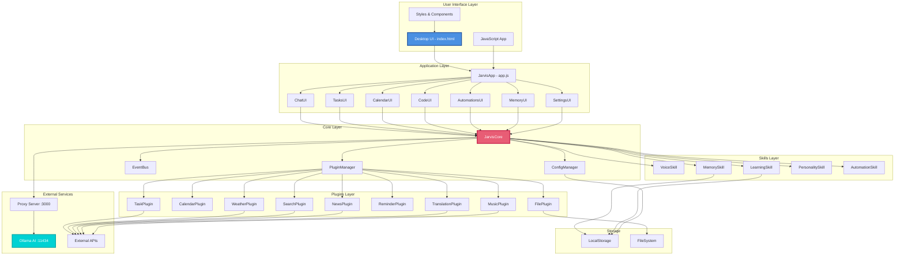

# JARVIS System Architecture Flowchart

## Layer Descriptions

### 1. User Interface Layer
- **Desktop UI**: Modern web interface with sidebar navigation
- **Styles**: CSS with theme variables and animations
- **JavaScript**: Main application controller

### 2. Application Layer
- **JarvisApp**: Central application manager
- **UI Components**: Modular view controllers for each feature

### 3. Core Layer
- **JarvisCore**: Central brain coordinating all systems
- **PluginManager**: Dynamic plugin loading and management
- **EventBus**: Pub/sub event system for loose coupling
- **ConfigManager**: Centralized configuration management

### 4. Skills Layer
- **VoiceSkill**: Speech recognition and text-to-speech
- **LearningSkill**: Adaptive learning from interactions
- **MemorySkill**: Short/long-term memory management
- **PersonalitySkill**: Personality traits and mood
- **AutomationSkill**: Routines, workflows, and scheduling

### 5. Plugins Layer
- **9 Plugins**: Modular feature extensions
- Each plugin is independently loadable
- Plugins communicate via EventBus

### 6. External Services
- **Proxy Server**: CORS-enabled bridge to Ollama
- **Ollama**: Local AI model runner
- **APIs**: External service integrations

### 7. Storage
- **LocalStorage**: Browser-based persistence
- **FileSystem**: File operations and data storage
