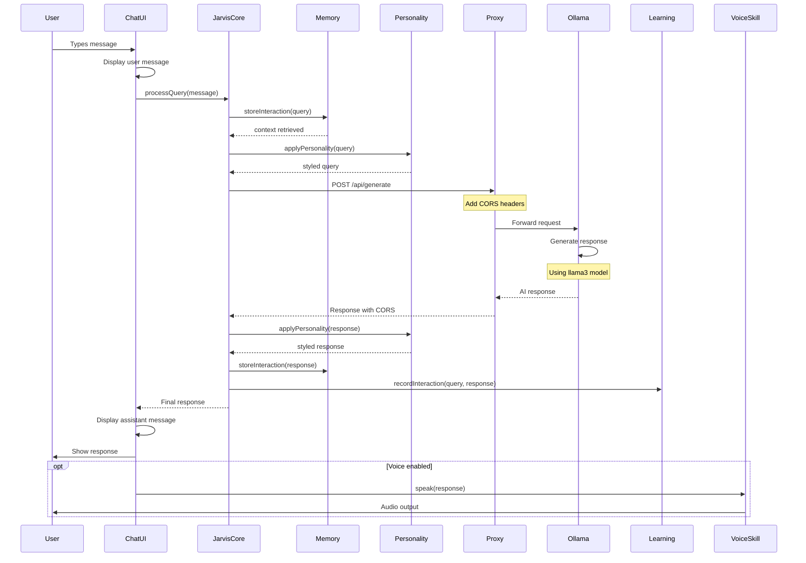

# User Query Processing Flow

## Flow Steps Explained

### 1. User Input (User → ChatUI)
- User types message in input field
- ChatUI validates and displays message
- Auto-resize textarea for longer messages

### 2. Query Processing (ChatUI → JarvisCore)
- Message sent to core for processing
- Core coordinates all subsystems

### 3. Context Retrieval (JarvisCore → Memory)
- Check short-term memory for recent context
- Retrieve relevant long-term memories
- Load user preferences and entities

### 4. Personality Application (JarvisCore → Personality)
- Apply current mood (friendly, professional, etc.)
- Use response style (concise, detailed, etc.)
- Add personality touches

### 5. AI Communication (JarvisCore → Proxy → Ollama)
- Format request for Ollama API
- Proxy adds CORS headers
- Forward to Ollama with context

### 6. AI Response Generation (Ollama)
- Process query with llama3 model
- Generate contextual response
- Return formatted output

### 7. Response Processing (Ollama → JarvisCore)
- Receive AI response
- Apply personality styling
- Store in memory for future context

### 8. Learning (JarvisCore → Learning)
- Record interaction for improvement
- Analyze patterns
- Update knowledge base

### 9. Display Response (JarvisCore → ChatUI)
- Format response for display
- Show in chat interface
- Optional: Speak response if voice enabled

## Timing

- **User Input**: Instant
- **Context Retrieval**: 10-50ms
- **Proxy Communication**: 50-100ms
- **AI Generation**: 1-5 seconds (depends on query complexity)
- **Response Display**: Instant
- **Total**: ~1.5-6 seconds
