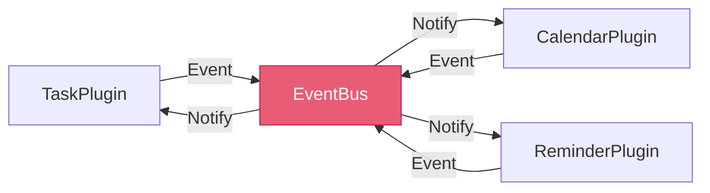

# Plugin System Flow

```mermaid
graph TB
    Start([Application Starts]) --> Init[JarvisCore.initialize]
    Init --> PMInit[PluginManager.initialize]
    
    PMInit --> Discover[Discover Plugins]
    Discover --> Task[TaskPlugin]
    Discover --> Calendar[CalendarPlugin]
    Discover --> Weather[WeatherPlugin]
    Discover --> Search[SearchPlugin]
    Discover --> File[FilePlugin]
    Discover --> Reminder[ReminderPlugin]
    Discover --> News[NewsPlugin]
    Discover --> Trans[TranslationPlugin]
    Discover --> Music[MusicPlugin]
    
    Task --> LoadTask{Load Plugin}
    Calendar --> LoadCal{Load Plugin}
    Weather --> LoadWeather{Load Plugin}
    Search --> LoadSearch{Load Plugin}
    File --> LoadFile{Load Plugin}
    Reminder --> LoadReminder{Load Plugin}
    News --> LoadNews{Load Plugin}
    Trans --> LoadTrans{Load Plugin}
    Music --> LoadMusic{Load Plugin}
    
    LoadTask --> ValidateTask{Validate}
    LoadCal --> ValidateCal{Validate}
    LoadWeather --> ValidateWeather{Validate}
    LoadSearch --> ValidateSearch{Validate}
    LoadFile --> ValidateFile{Validate}
    LoadReminder --> ValidateReminder{Validate}
    LoadNews --> ValidateNews{Validate}
    LoadTrans --> ValidateTrans{Validate}
    LoadMusic --> ValidateMusic{Validate}
    
    ValidateTask -->|Valid| RegTask[Register Plugin]
    ValidateCal -->|Valid| RegCal[Register Plugin]
    ValidateWeather -->|Valid| RegWeather[Register Plugin]
    ValidateSearch -->|Valid| RegSearch[Register Plugin]
    ValidateFile -->|Valid| RegFile[Register Plugin]
    ValidateReminder -->|Valid| RegReminder[Register Plugin]
    ValidateNews -->|Valid| RegNews[Register Plugin]
    ValidateTrans -->|Valid| RegTrans[Register Plugin]
    ValidateMusic -->|Valid| RegMusic[Register Plugin]
    
    ValidateTask -->|Invalid| Error1[Log Error]
    ValidateCal -->|Invalid| Error2[Log Error]
    ValidateWeather -->|Invalid| Error3[Log Error]
    ValidateSearch -->|Invalid| Error4[Log Error]
    ValidateFile -->|Invalid| Error5[Log Error]
    ValidateReminder -->|Invalid| Error6[Log Error]
    ValidateNews -->|Invalid| Error7[Log Error]
    ValidateTrans -->|Invalid| Error8[Log Error]
    ValidateMusic -->|Invalid| Error9[Log Error]
    
    RegTask --> InitPlugin1[plugin.initialize]
    RegCal --> InitPlugin2[plugin.initialize]
    RegWeather --> InitPlugin3[plugin.initialize]
    RegSearch --> InitPlugin4[plugin.initialize]
    RegFile --> InitPlugin5[plugin.initialize]
    RegReminder --> InitPlugin6[plugin.initialize]
    RegNews --> InitPlugin7[plugin.initialize]
    RegTrans --> InitPlugin8[plugin.initialize]
    RegMusic --> InitPlugin9[plugin.initialize]
    
    InitPlugin1 --> Subscribe1[Subscribe to Events]
    InitPlugin2 --> Subscribe2[Subscribe to Events]
    InitPlugin3 --> Subscribe3[Subscribe to Events]
    InitPlugin4 --> Subscribe4[Subscribe to Events]
    InitPlugin5 --> Subscribe5[Subscribe to Events]
    InitPlugin6 --> Subscribe6[Subscribe to Events]
    InitPlugin7 --> Subscribe7[Subscribe to Events]
    InitPlugin8 --> Subscribe8[Subscribe to Events]
    InitPlugin9 --> Subscribe9[Subscribe to Events]
    
    Subscribe1 --> Ready
    Subscribe2 --> Ready
    Subscribe3 --> Ready
    Subscribe4 --> Ready
    Subscribe5 --> Ready
    Subscribe6 --> Ready
    Subscribe7 --> Ready
    Subscribe8 --> Ready
    Subscribe9 --> Ready
    
    Ready([All Plugins Ready])
    
    style Start fill:#00d2d3,stroke:#00a8a9,color:#fff
    style Ready fill:#00b894,stroke:#00a074,color:#fff
    style Error1 fill:#d63031,stroke:#b71c1c,color:#fff
    style Error2 fill:#d63031,stroke:#b71c1c,color:#fff
    style Error3 fill:#d63031,stroke:#b71c1c,color:#fff
    style Error4 fill:#d63031,stroke:#b71c1c,color:#fff
    style Error5 fill:#d63031,stroke:#b71c1c,color:#fff
    style Error6 fill:#d63031,stroke:#b71c1c,color:#fff
    style Error7 fill:#d63031,stroke:#b71c1c,color:#fff
    style Error8 fill:#d63031,stroke:#b71c1c,color:#fff
    style Error9 fill:#d63031,stroke:#b71c1c,color:#fff
```



## Plugin Lifecycle

### 1. Discovery Phase
```javascript
// PluginManager discovers all plugins
const plugins = [
  TaskPlugin,
  CalendarPlugin,
  WeatherPlugin,
  // ... etc
];
```

### 2. Loading Phase
```javascript
for (const PluginClass of plugins) {
  const plugin = new PluginClass();
  // Validate plugin interface
}
```

### 3. Validation Phase
Each plugin must have:
- `name` property
- `version` property
- `initialize()` method
- `getCommands()` method
- `handleCommand()` method

### 4. Registration Phase
```javascript
this.plugins.set(plugin.name, plugin);
this.emit('plugin:registered', plugin.name);
```

### 5. Initialization Phase
```javascript
await plugin.initialize();
this.emit('plugin:initialized', plugin.name);
```

### 6. Event Subscription Phase
Plugins subscribe to relevant events:
```javascript
eventBus.on('query:processed', this.handleQuery);
eventBus.on('task:created', this.handleTask);
```

## Plugin Communication



## Error Handling

1. **Load Error**: Plugin file not found or invalid
   - Log error
   - Continue with other plugins
   - System still functional

2. **Validation Error**: Missing required methods
   - Skip plugin
   - Warn user
   - Don't crash system

3. **Initialization Error**: Plugin fails to start
   - Disable plugin
   - Log detailed error
   - Attempt recovery on next restart
