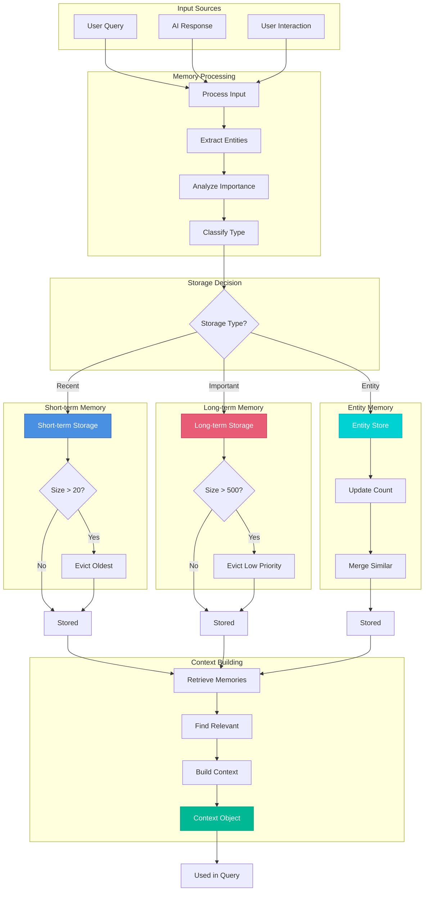
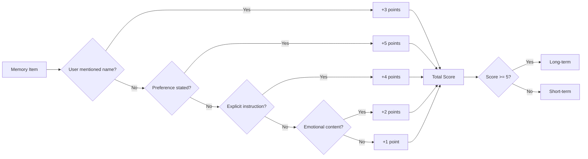
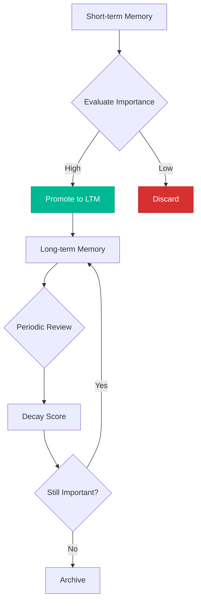

# Memory System Flow



## Memory Types

### 1. Short-term Memory (STM)
- **Capacity**: 20 items
- **Duration**: Current session
- **Purpose**: Recent conversation context
- **Eviction**: FIFO (First In, First Out)

```javascript
{
  content: "User asked about weather",
  timestamp: "2026-01-13T14:30:00Z",
  type: "query"
}
```

### 2. Long-term Memory (LTM)
- **Capacity**: 500 items
- **Duration**: Persistent across sessions
- **Purpose**: Important information
- **Eviction**: Priority-based (lowest first)

```javascript
{
  content: "User prefers Celsius",
  timestamp: "2026-01-10T10:00:00Z",
  importance: 8,
  type: "preference"
}
```

### 3. Entity Memory
- **Capacity**: Unlimited (merged)
- **Duration**: Persistent
- **Purpose**: Named entities and facts
- **Eviction**: Never (merged instead)

```javascript
{
  name: "John",
  type: "person",
  attributes: {
    role: "colleague",
    location: "Lisbon"
  },
  count: 15,
  lastMentioned: "2026-01-13T14:30:00Z"
}
```

## Importance Scoring



## Context Retrieval

### Search Algorithm
1. Get recent items from STM (last 5)
2. Search LTM for keyword matches
3. Find related entities
4. Rank by relevance
5. Combine into context object

### Relevance Calculation
```
relevance = (
  keyword_match * 0.4 +
  recency * 0.3 +
  importance * 0.2 +
  frequency * 0.1
)
```

## Memory Consolidation



## Usage Example

```javascript
// Store interaction
memory.storeInteraction({
  query: "What's the weather in Lisbon?",
  response: "It's 18°C and sunny in Lisbon.",
  timestamp: new Date()
});

// Retrieve context
const context = memory.getRelevantContext("weather");
// Returns:
// {
//   recent: [...], // Last 5 interactions
//   relevant: [...], // Related memories
//   entities: [...] // Related entities
// }
```
