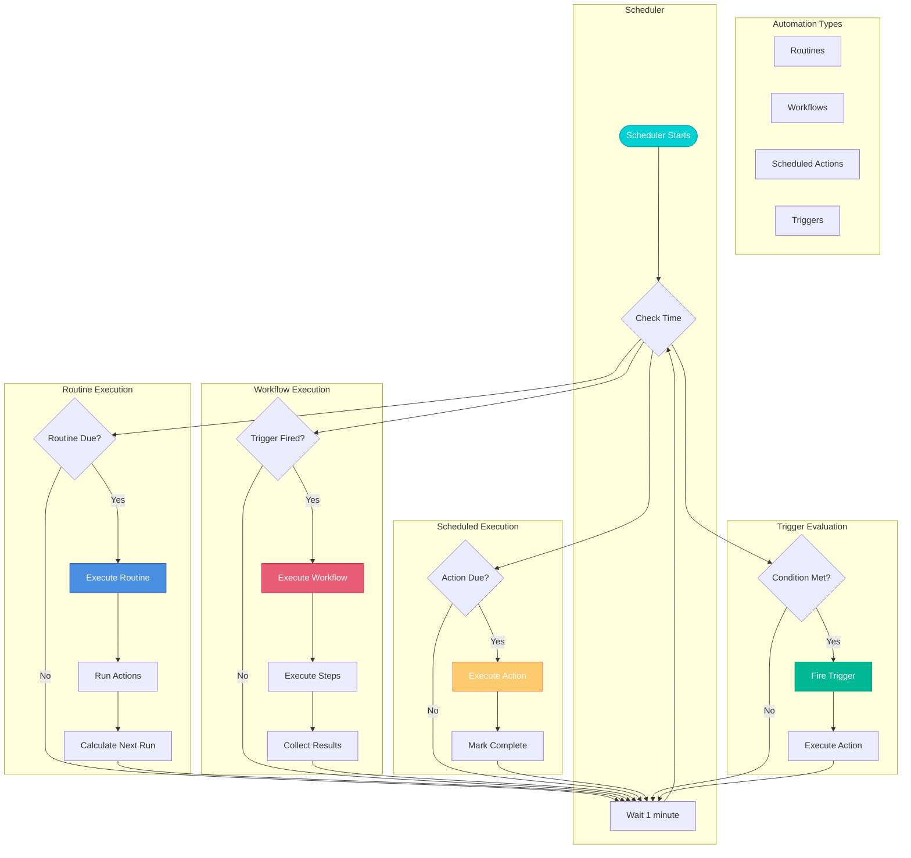
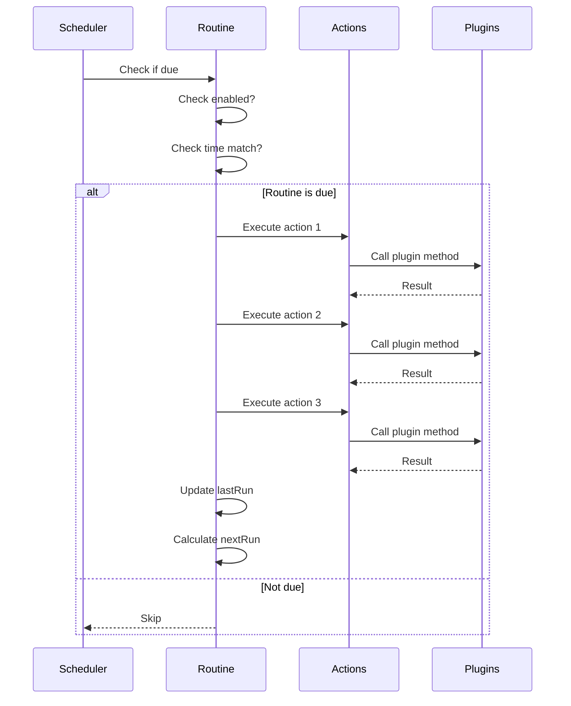
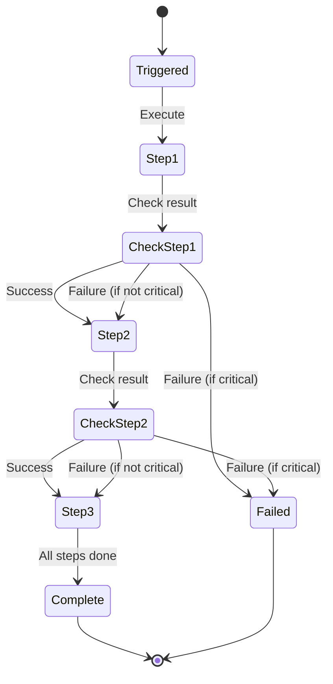
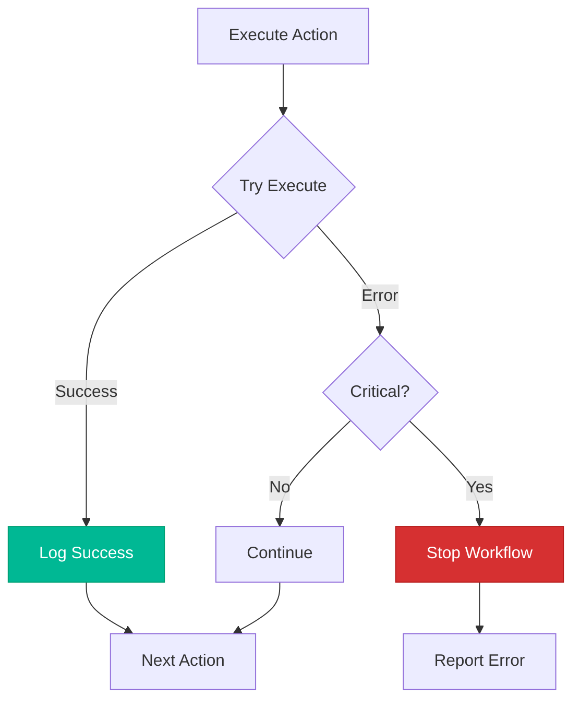

# Automation System Flow



## Automation Types

### 1. Routines (Recurring)
```javascript
{
  id: 1,
  name: "Morning Briefing",
  schedule: "daily",
  time: "09:00",
  actions: [
    { type: "speak", params: { text: "Good morning" } },
    { type: "weather", params: { location: "Lisbon" } },
    { type: "task", params: { list: "today" } }
  ]
}
```

### 2. Workflows (Sequential)
```javascript
{
  id: 2,
  name: "Project Setup",
  trigger: "manual",
  steps: [
    { 
      type: "task",
      params: { action: "create", title: "Initialize repo" },
      critical: true
    },
    {
      type: "task",
      params: { action: "create", title: "Setup CI/CD" },
      critical: false
    },
    {
      type: "notification",
      params: { message: "Project setup complete" }
    }
  ]
}
```

### 3. Scheduled Actions (One-time)
```javascript
{
  id: 3,
  name: "Meeting Reminder",
  action: "notification",
  params: {
    title: "Meeting in 15 minutes",
    message: "Team sync at 3pm"
  },
  scheduledFor: "2026-01-13T14:45:00Z"
}
```

### 4. Triggers (Conditional)
```javascript
{
  id: 4,
  name: "Low Battery Alert",
  type: "condition",
  condition: "battery < 20%",
  action: {
    type: "notification",
    params: { message: "Battery low, please charge" }
  }
}
```

## Routine Execution Flow



## Workflow Execution Flow



## Schedule Calculation

### Daily Schedule
```javascript
function calculateNextRun(schedule, time) {
  const [hours, minutes] = time.split(':');
  let next = new Date();
  next.setHours(hours, minutes, 0, 0);
  
  if (next <= new Date()) {
    // If time passed today, schedule for tomorrow
    next.setDate(next.getDate() + 1);
  }
  
  return next;
}
```

### Weekly Schedule
```javascript
function calculateNextWeekly(schedule, time, dayOfWeek) {
  let next = calculateNextRun(schedule, time);
  
  // Advance to target day of week
  while (next.getDay() !== dayOfWeek) {
    next.setDate(next.getDate() + 1);
  }
  
  return next;
}
```

## Action Types

| Type | Description | Example |
|------|-------------|----------|
| `notification` | Show system notification | `{ type: 'notification', params: { message: 'Hello' } }` |
| `speak` | Text-to-speech | `{ type: 'speak', params: { text: 'Good morning' } }` |
| `reminder` | Create reminder | `{ type: 'reminder', params: { message: 'Call John', time: '15:00' } }` |
| `task` | Create/manage task | `{ type: 'task', params: { action: 'create', title: 'New task' } }` |
| `weather` | Check weather | `{ type: 'weather', params: { location: 'Lisbon' } }` |
| `custom` | Custom handler | `{ type: 'custom', handler: async (params) => {...} }` |

## Error Handling



## Usage Examples

### Create Daily Routine
```javascript
automation.createRoutine({
  name: "Morning Briefing",
  description: "Daily morning updates",
  schedule: "daily",
  time: "09:00",
  actions: [
    { type: "speak", params: { text: "Good morning!" } },
    { type: "weather", params: { location: "Lisbon" } }
  ]
});
```

### Create Workflow
```javascript
automation.createWorkflow({
  name: "Deploy to Production",
  trigger: "manual",
  steps: [
    { type: "custom", handler: runTests, critical: true },
    { type: "custom", handler: buildApp, critical: true },
    { type: "custom", handler: deploy, critical: true },
    { type: "notification", params: { message: "Deployed!" } }
  ]
});
```

### Schedule One-time Action
```javascript
automation.scheduleAction({
  name: "Meeting Reminder",
  action: "notification",
  params: { message: "Meeting in 15 min" },
  when: new Date(Date.now() + 15 * 60 * 1000)
});
```
