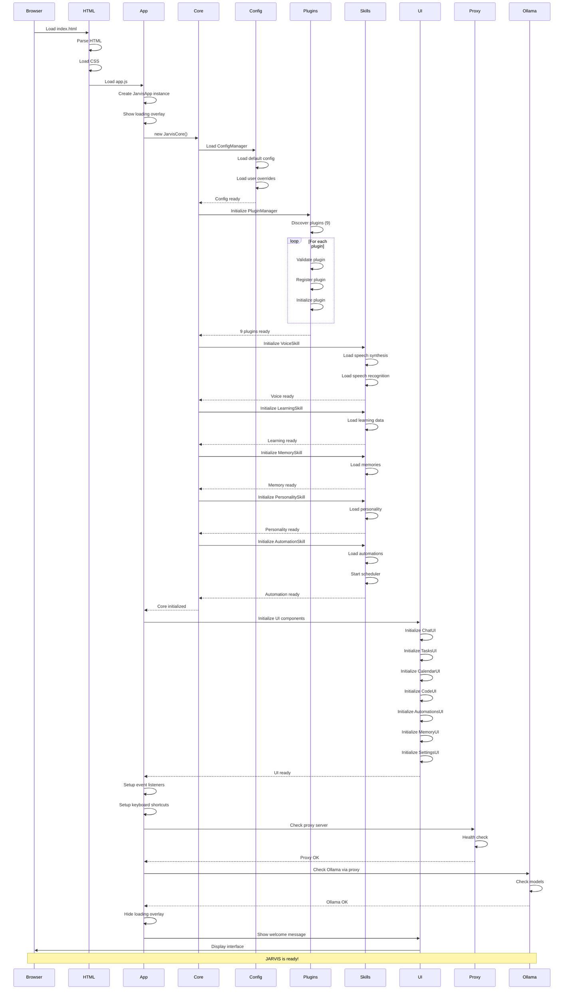
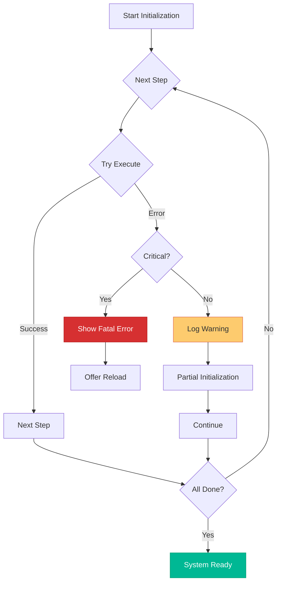

# JARVIS Initialization Flow



## Initialization Steps

### Phase 1: Bootstrap (0-500ms)
1. Browser loads HTML
2. Parse and render basic structure
3. Load CSS files
4. Load JavaScript modules
5. Create JarvisApp instance

### Phase 2: Core Initialization (500-1500ms)
1. Create JarvisCore
2. Load ConfigManager
   - Default configuration
   - User overrides from localStorage
3. Initialize EventBus
4. Setup error handlers

### Phase 3: Plugin Initialization (1500-2500ms)
1. Discover all plugins
2. For each plugin:
   - Validate interface
   - Create instance
   - Register with manager
   - Call initialize()
   - Subscribe to events
3. Verify all plugins loaded

### Phase 4: Skills Initialization (2500-3500ms)
1. **VoiceSkill**
   - Load speech synthesis
   - Load available voices
   - Setup speech recognition
   - Test audio capabilities

2. **LearningSkill**
   - Load learning data from storage
   - Initialize pattern analyzer
   - Setup feedback system

3. **MemorySkill**
   - Load short-term memory
   - Load long-term memory
   - Load entity memory
   - Build initial context

4. **PersonalitySkill**
   - Load personality traits
   - Load current mood
   - Load response style
   - Prepare greetings

5. **AutomationSkill**
   - Load routines
   - Load workflows
   - Load scheduled actions
   - Start scheduler

### Phase 5: UI Initialization (3500-4000ms)
1. Initialize all UI components
2. Setup DOM references
3. Attach event listeners
4. Load initial data
5. Setup keyboard shortcuts

### Phase 6: External Services Check (4000-5000ms)
1. Check proxy server availability
2. Check Ollama service
3. Verify model availability
4. Test connection

### Phase 7: Ready (5000ms)
1. Hide loading overlay
2. Show welcome message
3. Display interface
4. Ready for user input

## Initialization Error Handling



## Critical vs Non-Critical Errors

### Critical Errors (Stop Initialization)
- Core system fails to load
- ConfigManager fails
- EventBus fails
- All plugins fail to load
- Fatal JavaScript errors

### Non-Critical Errors (Continue with Warnings)
- Single plugin fails to load
- Voice skill unavailable
- Proxy server not responding
- Ollama not available
- LocalStorage not accessible

## Startup Performance

```mermaid
gantt
    title JARVIS Initialization Timeline
    dateFormat X
    axisFormat %Ss
    
    section Bootstrap
    Load HTML & CSS :0, 500ms
    Load JavaScript :500ms, 1000ms
    
    section Core
    Initialize Core :1000ms, 1500ms
    Initialize Config :1500ms, 2000ms
    
    section Plugins
    Load Plugins :2000ms, 3000ms
    
    section Skills
    Load Skills :3000ms, 4000ms
    
    section UI
    Initialize UI :4000ms, 4500ms
    
    section Services
    Check Services :4500ms, 5000ms
    
    section Ready
    Display Interface :5000ms, 5200ms
```

## Optimization Tips

1. **Lazy Load Non-Essential Plugins**
   ```javascript
   // Load heavy plugins after initial render
   setTimeout(() => {
     pluginManager.loadPlugin(HeavyPlugin);
   }, 5000);
   ```

2. **Parallel Initialization**
   ```javascript
   // Initialize skills in parallel
   await Promise.all([
     voice.initialize(),
     learning.initialize(),
     memory.initialize()
   ]);
   ```

3. **Progressive Enhancement**
   ```javascript
   // Show basic UI first, enhance later
   showBasicUI();
   await loadEnhancements();
   ```

4. **Cache Configuration**
   ```javascript
   // Cache config in localStorage
   const cached = localStorage.getItem('config');
   if (cached) return JSON.parse(cached);
   ```
