# JARVIS Complete System Flow - Detailed Flowchart

## Full System Architecture with Data Flow

```mermaid
graph TB
    Start([👤 User Opens JARVIS]) --> LoadHTML[📄 Load index.html]
    LoadHTML --> ParseHTML[🔍 Parse HTML Structure]
    ParseHTML --> LoadCSS[🎨 Load styles.css]
    LoadCSS --> LoadJS[⚙️ Load app.js]
    
    LoadJS --> CreateApp[🚀 Create JarvisApp]
    CreateApp --> InitCore[🧠 Initialize JarvisCore]
    
    InitCore --> InitConfig[📋 ConfigManager]
    InitConfig --> LoadDefaultConfig[Load Default Settings]
    LoadDefaultConfig --> LoadUserConfig[Load User Preferences]
    LoadUserConfig --> ConfigReady[✅ Config Ready]
    
    ConfigReady --> InitPlugins[🔌 Initialize Plugins]
    
    InitPlugins --> DiscoverPlugins[🔍 Discover 9 Plugins]
    DiscoverPlugins --> TaskPlugin[📝 TaskPlugin]
    DiscoverPlugins --> CalendarPlugin[📅 CalendarPlugin]
    DiscoverPlugins --> WeatherPlugin[🌤️ WeatherPlugin]
    DiscoverPlugins --> SearchPlugin[🔎 SearchPlugin]
    DiscoverPlugins --> FilePlugin[📁 FilePlugin]
    DiscoverPlugins --> ReminderPlugin[⏰ ReminderPlugin]
    DiscoverPlugins --> NewsPlugin[📰 NewsPlugin]
    DiscoverPlugins --> TransPlugin[🌍 TranslationPlugin]
    DiscoverPlugins --> MusicPlugin[🎵 MusicPlugin]
    
    TaskPlugin --> ValidatePlugin1{Valid?}
    CalendarPlugin --> ValidatePlugin2{Valid?}
    WeatherPlugin --> ValidatePlugin3{Valid?}
    SearchPlugin --> ValidatePlugin4{Valid?}
    FilePlugin --> ValidatePlugin5{Valid?}
    ReminderPlugin --> ValidatePlugin6{Valid?}
    NewsPlugin --> ValidatePlugin7{Valid?}
    TransPlugin --> ValidatePlugin8{Valid?}
    MusicPlugin --> ValidatePlugin9{Valid?}
    
    ValidatePlugin1 -->|Yes| RegPlugin1[Register]
    ValidatePlugin2 -->|Yes| RegPlugin2[Register]
    ValidatePlugin3 -->|Yes| RegPlugin3[Register]
    ValidatePlugin4 -->|Yes| RegPlugin4[Register]
    ValidatePlugin5 -->|Yes| RegPlugin5[Register]
    ValidatePlugin6 -->|Yes| RegPlugin6[Register]
    ValidatePlugin7 -->|Yes| RegPlugin7[Register]
    ValidatePlugin8 -->|Yes| RegPlugin8[Register]
    ValidatePlugin9 -->|Yes| RegPlugin9[Register]
    
    ValidatePlugin1 -->|No| SkipPlugin1[❌ Skip]
    ValidatePlugin2 -->|No| SkipPlugin2[❌ Skip]
    ValidatePlugin3 -->|No| SkipPlugin3[❌ Skip]
    ValidatePlugin4 -->|No| SkipPlugin4[❌ Skip]
    ValidatePlugin5 -->|No| SkipPlugin5[❌ Skip]
    ValidatePlugin6 -->|No| SkipPlugin6[❌ Skip]
    ValidatePlugin7 -->|No| SkipPlugin7[❌ Skip]
    ValidatePlugin8 -->|No| SkipPlugin8[❌ Skip]
    ValidatePlugin9 -->|No| SkipPlugin9[❌ Skip]
    
    RegPlugin1 --> PluginsReady
    RegPlugin2 --> PluginsReady
    RegPlugin3 --> PluginsReady
    RegPlugin4 --> PluginsReady
    RegPlugin5 --> PluginsReady
    RegPlugin6 --> PluginsReady
    RegPlugin7 --> PluginsReady
    RegPlugin8 --> PluginsReady
    RegPlugin9 --> PluginsReady
    SkipPlugin1 --> PluginsReady
    SkipPlugin2 --> PluginsReady
    SkipPlugin3 --> PluginsReady
    SkipPlugin4 --> PluginsReady
    SkipPlugin5 --> PluginsReady
    SkipPlugin6 --> PluginsReady
    SkipPlugin7 --> PluginsReady
    SkipPlugin8 --> PluginsReady
    SkipPlugin9 --> PluginsReady
    
    PluginsReady[✅ Plugins Ready] --> InitSkills[🎓 Initialize Skills]
    
    InitSkills --> InitVoice[🎤 VoiceSkill]
    InitVoice --> LoadSpeech[Load Speech Synthesis]
    LoadSpeech --> LoadRecog[Load Speech Recognition]
    LoadRecog --> VoiceReady[✅ Voice Ready]
    
    InitSkills --> InitLearning[📚 LearningSkill]
    InitLearning --> LoadLearningData[Load Learning Data]
    LoadLearningData --> LearningReady[✅ Learning Ready]
    
    InitSkills --> InitMemory[🧠 MemorySkill]
    InitMemory --> LoadSTM[Load Short-term Memory]
    LoadSTM --> LoadLTM[Load Long-term Memory]
    LoadLTM --> LoadEntities[Load Entities]
    LoadEntities --> MemoryReady[✅ Memory Ready]
    
    InitSkills --> InitPersonality[😊 PersonalitySkill]
    InitPersonality --> LoadTraits[Load Personality Traits]
    LoadTraits --> LoadMood[Load Current Mood]
    LoadMood --> PersonalityReady[✅ Personality Ready]
    
    InitSkills --> InitAutomation[⚡ AutomationSkill]
    InitAutomation --> LoadRoutines[Load Routines]
    LoadRoutines --> LoadWorkflows[Load Workflows]
    LoadWorkflows --> StartScheduler[Start Scheduler]
    StartScheduler --> AutomationReady[✅ Automation Ready]
    
    VoiceReady --> SkillsComplete
    LearningReady --> SkillsComplete
    MemoryReady --> SkillsComplete
    PersonalityReady --> SkillsComplete
    AutomationReady --> SkillsComplete
    
    SkillsComplete[✅ All Skills Ready] --> InitUI[🖥️ Initialize UI]
    
    InitUI --> InitChatUI[💬 ChatUI]
    InitUI --> InitTasksUI[📝 TasksUI]
    InitUI --> InitCalendarUI[📅 CalendarUI]
    InitUI --> InitCodeUI[💻 CodeUI]
    InitUI --> InitAutoUI[⚡ AutomationsUI]
    InitUI --> InitMemUI[🧠 MemoryUI]
    InitUI --> InitSettingsUI[⚙️ SettingsUI]
    
    InitChatUI --> UIReady
    InitTasksUI --> UIReady
    InitCalendarUI --> UIReady
    InitCodeUI --> UIReady
    InitAutoUI --> UIReady
    InitMemUI --> UIReady
    InitSettingsUI --> UIReady
    
    UIReady[✅ UI Ready] --> CheckServices[🔍 Check External Services]
    
    CheckServices --> CheckProxy{Proxy Server OK?}
    CheckProxy -->|Yes| CheckOllama{Ollama OK?}
    CheckProxy -->|No| ProxyError[⚠️ Proxy Unavailable]
    
    CheckOllama -->|Yes| AllReady[🎉 JARVIS READY!]
    CheckOllama -->|No| OllamaError[⚠️ AI Unavailable]
    
    ProxyError --> PartialReady[⚠️ Partial Mode]
    OllamaError --> PartialReady
    
    AllReady --> WaitInput[⏳ Waiting for User Input...]
    PartialReady --> WaitInput
    
    WaitInput --> UserTypes[👤 User Types Message]
    UserTypes --> ProcessQuery[🔄 Process Query]
    
    ProcessQuery --> GetContext[🧠 Get Memory Context]
    GetContext --> ApplyPersonality1[😊 Apply Personality]
    ApplyPersonality1 --> SendToAI[🤖 Send to Ollama]
    
    SendToAI --> AIGenerates[⚙️ AI Generates Response]
    AIGenerates --> ReceiveResponse[📨 Receive Response]
    
    ReceiveResponse --> ApplyPersonality2[😊 Apply Personality]
    ApplyPersonality2 --> StoreMemory[💾 Store in Memory]
    StoreMemory --> RecordLearning[📚 Record for Learning]
    
    RecordLearning --> DisplayResponse[💬 Display Response]
    DisplayResponse --> VoiceCheck{Voice Enabled?}
    
    VoiceCheck -->|Yes| SpeakResponse[🔊 Speak Response]
    VoiceCheck -->|No| WaitNextInput
    SpeakResponse --> WaitNextInput
    
    WaitNextInput[⏳ Wait for Next Input] --> UserTypes
    
    style Start fill:#00d2d3,stroke:#00a8a9,stroke-width:3px,color:#fff
    style AllReady fill:#00b894,stroke:#00a074,stroke-width:3px,color:#fff
    style ProxyError fill:#fdcb6e,stroke:#e17055,stroke-width:2px,color:#333
    style OllamaError fill:#fdcb6e,stroke:#e17055,stroke-width:2px,color:#333
    style SkipPlugin1 fill:#d63031,stroke:#b71c1c,stroke-width:2px,color:#fff
    style SkipPlugin2 fill:#d63031,stroke:#b71c1c,stroke-width:2px,color:#fff
    style SkipPlugin3 fill:#d63031,stroke:#b71c1c,stroke-width:2px,color:#fff
    style SkipPlugin4 fill:#d63031,stroke:#b71c1c,stroke-width:2px,color:#fff
    style SkipPlugin5 fill:#d63031,stroke:#b71c1c,stroke-width:2px,color:#fff
    style SkipPlugin6 fill:#d63031,stroke:#b71c1c,stroke-width:2px,color:#fff
    style SkipPlugin7 fill:#d63031,stroke:#b71c1c,stroke-width:2px,color:#fff
    style SkipPlugin8 fill:#d63031,stroke:#b71c1c,stroke-width:2px,color:#fff
    style SkipPlugin9 fill:#d63031,stroke:#b71c1c,stroke-width:2px,color:#fff
```



## Timeline

| Time | Phase | Status |
|------|-------|--------|
| 0-500ms | HTML/CSS/JS Loading | ⏳ Loading |
| 500-1000ms | Core Initialization | ⏳ Initializing |
| 1000-2500ms | Plugin Discovery & Registration | ⏳ Loading Plugins |
| 2500-3500ms | Skills Initialization | ⏳ Loading Skills |
| 3500-4000ms | UI Component Setup | ⏳ Building Interface |
| 4000-5000ms | External Services Check | ⏳ Checking Services |
| 5000ms+ | Ready for Use | ✅ Ready! |

## Complete Data Flow

```
👤 User Input
    ↓
💬 ChatUI (validate, display)
    ↓
🧠 JarvisCore (coordinate)
    ↓
🔍 Memory (get context: STM + LTM + Entities)
    ↓
😊 Personality (apply mood & style)
    ↓
🌐 Proxy Server (add CORS)
    ↓
🤖 Ollama AI (generate with llama3)
    ↓
📨 Response
    ↓
😊 Personality (style response)
    ↓
💾 Memory (store interaction)
    ↓
📚 Learning (record pattern)
    ↓
💬 Display to User
    ↓
🔊 Speak (if enabled)
    ↓
⏳ Wait for next input
```
