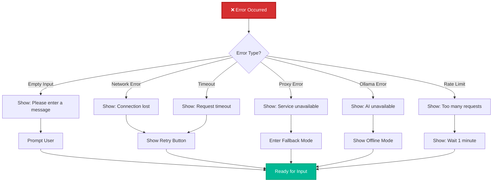

# Detailed User Query Processing Flowchart

## Complete Query Processing with All Steps

```mermaid
flowchart TD
    Start([👤 User Ready to Ask]) --> TypeMessage[📝 User Types Message]
    TypeMessage --> PressEnter[⏎ User Presses Enter]
    
    PressEnter --> ValidateInput{Input Valid?}
    ValidateInput -->|Empty| ShowError[❌ Show Error: Empty Message]
    ValidateInput -->|Too Long| TruncateMsg[✂️ Truncate to Max Length]
    ValidateInput -->|Valid| DisplayUserMsg[💬 Display User Message]
    
    ShowError --> Start
    TruncateMsg --> DisplayUserMsg
    
    DisplayUserMsg --> CreateQuery[📦 Create Query Object]
    CreateQuery --> SendToCore[➡️ Send to JarvisCore]
    
    SendToCore --> StoreQuery[💾 Store Query in STM]
    StoreQuery --> AnalyzeQuery[🔍 Analyze Query]
    
    AnalyzeQuery --> ExtractIntent[🎯 Extract Intent]
    ExtractIntent --> ExtractEntities[🏷️ Extract Entities]
    ExtractEntities --> CheckContext[🧠 Check Memory Context]
    
    CheckContext --> GetSTM[📋 Get Short-term Memory]
    GetSTM --> GetLTM[📚 Get Long-term Memory]
    GetLTM --> GetEntities[👤 Get Entity Memory]
    GetEntities --> BuildContext[🔧 Build Context Object]
    
    BuildContext --> ApplyMood[😊 Get Current Mood]
    ApplyMood --> ApplyStyle[🎨 Get Response Style]
    ApplyStyle --> ApplyTone[🗣️ Apply Personality Tone]
    ApplyTone --> StyledQuery[✨ Styled Query Ready]
    
    StyledQuery --> PrepareRequest[📋 Prepare AI Request]
    PrepareRequest --> AddContext[➕ Add Context to Request]
    AddContext --> AddHistory[📜 Add Chat History]
    AddHistory --> AddSystemPrompt[🤖 Add System Prompt]
    AddSystemPrompt --> RequestReady[✅ Request Ready]
    
    RequestReady --> SendToProxy[🌐 POST to Proxy :3000]
    SendToProxy --> ProxyCheck{Proxy Available?}
    
    ProxyCheck -->|No| ProxyError[❌ Proxy Error]
    ProxyCheck -->|Yes| AddCORS[🔐 Add CORS Headers]
    
    ProxyError --> ShowProxyError[⚠️ Show: Service Unavailable]
    ShowProxyError --> End1([End])
    
    AddCORS --> ForwardToOllama[➡️ Forward to Ollama :11434]
    ForwardToOllama --> OllamaCheck{Ollama Available?}
    
    OllamaCheck -->|No| OllamaError[❌ Ollama Error]
    OllamaCheck -->|Yes| LoadModel[📦 Load llama3 Model]
    
    OllamaError --> ShowAIError[⚠️ Show: AI Unavailable]
    ShowAIError --> End2([End])
    
    LoadModel --> ProcessPrompt[⚙️ Process Prompt]
    ProcessPrompt --> GenerateTokens[🔤 Generate Tokens]
    GenerateTokens --> BuildResponse[🔨 Build Response]
    BuildResponse --> FormatOutput[📝 Format Output]
    FormatOutput --> ResponseReady[✅ AI Response Ready]
    
    ResponseReady --> SendBack[⬅️ Send Back to Proxy]
    SendBack --> ProxyReturn[⬅️ Proxy Returns to Core]
    ProxyReturn --> ReceiveResponse[📨 Core Receives Response]
    
    ReceiveResponse --> ApplyPersonality[😊 Apply Personality]
    ApplyPersonality --> StyleResponse[🎨 Style Response]
    StyleResponse --> AddEmoji[😀 Add Appropriate Emojis]
    AddEmoji --> FormatMarkdown[📄 Format as Markdown]
    FormatMarkdown --> FinalResponse[✨ Final Response Ready]
    
    FinalResponse --> StoreInSTM[💾 Store in Short-term]
    StoreInSTM --> UpdateLTM{Important?}
    
    UpdateLTM -->|Yes| StoreInLTM[📚 Store in Long-term]
    UpdateLTM -->|No| SkipLTM[⏭️ Skip LTM]
    
    StoreInLTM --> UpdateEntities
    SkipLTM --> UpdateEntities
    
    UpdateEntities[🏷️ Update Entity Memory] --> RecordInteraction[📊 Record Interaction]
    RecordInteraction --> AnalyzePatterns[🔍 Analyze Patterns]
    AnalyzePatterns --> UpdateLearning[📚 Update Learning Data]
    UpdateLearning --> LearningComplete[✅ Learning Updated]
    
    LearningComplete --> DisplayResponse[💬 Display Response]
    DisplayResponse --> AnimateIn[✨ Animate Message In]
    AnimateIn --> RenderMarkdown[📄 Render Markdown]
    RenderMarkdown --> CheckVoice{Voice Enabled?}
    
    CheckVoice -->|No| ResponseComplete
    CheckVoice -->|Yes| PrepareVoice[🎤 Prepare Text-to-Speech]
    
    PrepareVoice --> SelectVoice[🗣️ Select Voice]
    SelectVoice --> SetRate[⚡ Set Speech Rate]
    SetRate --> SetPitch[🎵 Set Pitch]
    SetPitch --> SpeakText[🔊 Speak Text]
    SpeakText --> VoiceComplete[✅ Voice Complete]
    
    VoiceComplete --> ResponseComplete
    ResponseComplete[🎉 Response Complete] --> ScrollToBottom[⬇️ Scroll to Bottom]
    ScrollToBottom --> FocusInput[🎯 Focus Input Field]
    FocusInput --> WaitNext[⏳ Wait for Next Query]
    
    WaitNext --> Start
    
    style Start fill:#00d2d3,stroke:#00a8a9,stroke-width:3px,color:#fff
    style ResponseComplete fill:#00b894,stroke:#00a074,stroke-width:3px,color:#fff
    style ShowError fill:#d63031,stroke:#b71c1c,stroke-width:2px,color:#fff
    style ProxyError fill:#d63031,stroke:#b71c1c,stroke-width:2px,color:#fff
    style OllamaError fill:#d63031,stroke:#b71c1c,stroke-width:2px,color:#fff
    style ShowProxyError fill:#fdcb6e,stroke:#e17055,stroke-width:2px,color:#333
    style ShowAIError fill:#fdcb6e,stroke:#e17055,stroke-width:2px,color:#333
```

## Detailed Step Breakdown

### Phase 1: Input Processing (0-100ms)
1. User types message
2. Validate input (empty, length, characters)
3. Display user message in chat
4. Create query object with metadata

### Phase 2: Context Retrieval (10-50ms)
5. Store query in short-term memory
6. Analyze query for intent and entities
7. Retrieve relevant memories:
   - Last 5 items from STM
   - Keyword matches from LTM
   - Related entities
8. Build context object

### Phase 3: Personality Application (5-20ms)
9. Get current mood (friendly, professional, playful)
10. Get response style (concise, detailed, technical)
11. Apply personality tone to query
12. Prepare styled query

### Phase 4: AI Request Preparation (10-30ms)
13. Prepare request payload
14. Add context from memory
15. Add chat history (last N messages)
16. Add system prompt with personality
17. Validate request structure

### Phase 5: Network Communication (50-100ms)
18. POST request to Proxy Server (port 3000)
19. Proxy validates request
20. Proxy adds CORS headers
21. Forward to Ollama (port 11434)

### Phase 6: AI Generation (1000-5000ms)
22. Ollama loads llama3 model
23. Process prompt with context
24. Generate tokens sequentially
25. Build complete response
26. Format output as JSON

### Phase 7: Response Processing (20-50ms)
27. Receive response from Ollama
28. Proxy returns to Core
29. Apply personality styling
30. Add emojis if appropriate
31. Format as Markdown

### Phase 8: Memory & Learning (10-30ms)
32. Store in short-term memory
33. Check importance score
34. Store in long-term if important
35. Update entity mentions
36. Record interaction for learning
37. Analyze patterns

### Phase 9: Display & Voice (50-200ms)
38. Display response in chat
39. Animate message appearance
40. Render Markdown formatting
41. If voice enabled:
    - Select voice
    - Set rate and pitch
    - Speak text
42. Scroll to bottom
43. Focus input field

### Phase 10: Ready for Next (Instant)
44. Wait for next user input
45. Loop back to start

## Error Handling Paths

## Performance Metrics

| Metric | Target | Typical |
|--------|--------|----------|
| Input Validation | <10ms | 5ms |
| Context Retrieval | <50ms | 25ms |
| Personality Application | <20ms | 10ms |
| Network Round-trip | <100ms | 75ms |
| AI Generation | <5000ms | 2500ms |
| Response Processing | <50ms | 30ms |
| Memory Storage | <30ms | 15ms |
| Display Rendering | <100ms | 50ms |
| Voice Output | <200ms | 150ms |
| **Total** | **<6s** | **~3s** |
