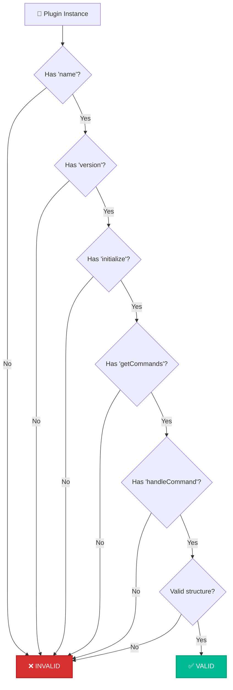

# Complete Plugin Lifecycle Flowchart

## Detailed Plugin System Flow

```mermaid
flowchart TD
    Start([🚀 PluginManager Starts]) --> InitManager[⚙️ Initialize Plugin Manager]
    InitManager --> CreateRegistry[📋 Create Plugin Registry]
    CreateRegistry --> SetupEventBus[📡 Setup EventBus]
    SetupEventBus --> ReadyToDiscover[✅ Ready to Discover]
    
    ReadyToDiscover --> DiscoverPhase[🔍 DISCOVERY PHASE]
    
    DiscoverPhase --> ScanPlugins[📂 Scan Plugin Directory]
    ScanPlugins --> FindTask[📝 Found: TaskPlugin.js]
    ScanPlugins --> FindCalendar[📅 Found: CalendarPlugin.js]
    ScanPlugins --> FindWeather[🌤️ Found: WeatherPlugin.js]
    ScanPlugins --> FindSearch[🔎 Found: SearchPlugin.js]
    ScanPlugins --> FindFile[📁 Found: FilePlugin.js]
    ScanPlugins --> FindReminder[⏰ Found: ReminderPlugin.js]
    ScanPlugins --> FindNews[📰 Found: NewsPlugin.js]
    ScanPlugins --> FindTrans[🌍 Found: TranslationPlugin.js]
    ScanPlugins --> FindMusic[🎵 Found: MusicPlugin.js]
    
    FindTask --> LoadPhase
    FindCalendar --> LoadPhase
    FindWeather --> LoadPhase
    FindSearch --> LoadPhase
    FindFile --> LoadPhase
    FindReminder --> LoadPhase
    FindNews --> LoadPhase
    FindTrans --> LoadPhase
    FindMusic --> LoadPhase
    
    LoadPhase[📦 LOADING PHASE] --> LoadTask[Load TaskPlugin]
    LoadPhase --> LoadCalendar[Load CalendarPlugin]
    LoadPhase --> LoadWeather[Load WeatherPlugin]
    LoadPhase --> LoadSearch[Load SearchPlugin]
    LoadPhase --> LoadFile[Load FilePlugin]
    LoadPhase --> LoadReminder[Load ReminderPlugin]
    LoadPhase --> LoadNews[Load NewsPlugin]
    LoadPhase --> LoadTrans[Load TranslationPlugin]
    LoadPhase --> LoadMusic[Load MusicPlugin]
    
    LoadTask --> InstTask[new TaskPlugin]
    LoadCalendar --> InstCalendar[new CalendarPlugin]
    LoadWeather --> InstWeather[new WeatherPlugin]
    LoadSearch --> InstSearch[new SearchPlugin]
    LoadFile --> InstFile[new FilePlugin]
    LoadReminder --> InstReminder[new ReminderPlugin]
    LoadNews --> InstNews[new NewsPlugin]
    LoadTrans --> InstTrans[new TranslationPlugin]
    LoadMusic --> InstMusic[new MusicPlugin]
    
    InstTask --> ValTask
    InstCalendar --> ValCalendar
    InstWeather --> ValWeather
    InstSearch --> ValSearch
    InstFile --> ValFile
    InstReminder --> ValReminder
    InstNews --> ValNews
    InstTrans --> ValTrans
    InstMusic --> ValMusic
    
    ValTask[🔍 Validate TaskPlugin] --> CheckTask{Valid?}
    ValCalendar[🔍 Validate CalendarPlugin] --> CheckCalendar{Valid?}
    ValWeather[🔍 Validate WeatherPlugin] --> CheckWeather{Valid?}
    ValSearch[🔍 Validate SearchPlugin] --> CheckSearch{Valid?}
    ValFile[🔍 Validate FilePlugin] --> CheckFile{Valid?}
    ValReminder[🔍 Validate ReminderPlugin] --> CheckReminder{Valid?}
    ValNews[🔍 Validate NewsPlugin] --> CheckNews{Valid?}
    ValTrans[🔍 Validate TranslationPlugin] --> CheckTrans{Valid?}
    ValMusic[🔍 Validate MusicPlugin] --> CheckMusic{Valid?}
    
    CheckTask -->|✅ Yes| RegTask[✅ Register TaskPlugin]
    CheckTask -->|❌ No| ErrTask[❌ Error: Invalid TaskPlugin]
    
    CheckCalendar -->|✅ Yes| RegCalendar[✅ Register CalendarPlugin]
    CheckCalendar -->|❌ No| ErrCalendar[❌ Error: Invalid CalendarPlugin]
    
    CheckWeather -->|✅ Yes| RegWeather[✅ Register WeatherPlugin]
    CheckWeather -->|❌ No| ErrWeather[❌ Error: Invalid WeatherPlugin]
    
    CheckSearch -->|✅ Yes| RegSearch[✅ Register SearchPlugin]
    CheckSearch -->|❌ No| ErrSearch[❌ Error: Invalid SearchPlugin]
    
    CheckFile -->|✅ Yes| RegFile[✅ Register FilePlugin]
    CheckFile -->|❌ No| ErrFile[❌ Error: Invalid FilePlugin]
    
    CheckReminder -->|✅ Yes| RegReminder[✅ Register ReminderPlugin]
    CheckReminder -->|❌ No| ErrReminder[❌ Error: Invalid ReminderPlugin]
    
    CheckNews -->|✅ Yes| RegNews[✅ Register NewsPlugin]
    CheckNews -->|❌ No| ErrNews[❌ Error: Invalid NewsPlugin]
    
    CheckTrans -->|✅ Yes| RegTrans[✅ Register TranslationPlugin]
    CheckTrans -->|❌ No| ErrTrans[❌ Error: Invalid TranslationPlugin]
    
    CheckMusic -->|✅ Yes| RegMusic[✅ Register MusicPlugin]
    CheckMusic -->|❌ No| ErrMusic[❌ Error: Invalid MusicPlugin]
    
    ErrTask --> LogError1[📝 Log Error]
    ErrCalendar --> LogError2[📝 Log Error]
    ErrWeather --> LogError3[📝 Log Error]
    ErrSearch --> LogError4[📝 Log Error]
    ErrFile --> LogError5[📝 Log Error]
    ErrReminder --> LogError6[📝 Log Error]
    ErrNews --> LogError7[📝 Log Error]
    ErrTrans --> LogError8[📝 Log Error]
    ErrMusic --> LogError9[📝 Log Error]
    
    LogError1 --> InitPhase
    LogError2 --> InitPhase
    LogError3 --> InitPhase
    LogError4 --> InitPhase
    LogError5 --> InitPhase
    LogError6 --> InitPhase
    LogError7 --> InitPhase
    LogError8 --> InitPhase
    LogError9 --> InitPhase
    
    RegTask --> InitTask
    RegCalendar --> InitCalendar
    RegWeather --> InitWeather
    RegSearch --> InitSearch
    RegFile --> InitFile
    RegReminder --> InitReminder
    RegNews --> InitNews
    RegTrans --> InitTrans
    RegMusic --> InitMusic
    
    InitPhase[⚡ INITIALIZATION PHASE]
    
    InitTask[⚡ Initialize TaskPlugin] --> TaskInit{Success?}
    InitCalendar[⚡ Initialize CalendarPlugin] --> CalendarInit{Success?}
    InitWeather[⚡ Initialize WeatherPlugin] --> WeatherInit{Success?}
    InitSearch[⚡ Initialize SearchPlugin] --> SearchInit{Success?}
    InitFile[⚡ Initialize FilePlugin] --> FileInit{Success?}
    InitReminder[⚡ Initialize ReminderPlugin] --> ReminderInit{Success?}
    InitNews[⚡ Initialize NewsPlugin] --> NewsInit{Success?}
    InitTrans[⚡ Initialize TranslationPlugin] --> TransInit{Success?}
    InitMusic[⚡ Initialize MusicPlugin] --> MusicInit{Success?}
    
    TaskInit -->|✅| SubTask[📡 Subscribe to Events]
    CalendarInit -->|✅| SubCalendar[📡 Subscribe to Events]
    WeatherInit -->|✅| SubWeather[📡 Subscribe to Events]
    SearchInit -->|✅| SubSearch[📡 Subscribe to Events]
    FileInit -->|✅| SubFile[📡 Subscribe to Events]
    ReminderInit -->|✅| SubReminder[📡 Subscribe to Events]
    NewsInit -->|✅| SubNews[📡 Subscribe to Events]
    TransInit -->|✅| SubTrans[📡 Subscribe to Events]
    MusicInit -->|✅| SubMusic[📡 Subscribe to Events]
    
    TaskInit -->|❌| DisableTask[⚠️ Disable TaskPlugin]
    CalendarInit -->|❌| DisableCalendar[⚠️ Disable CalendarPlugin]
    WeatherInit -->|❌| DisableWeather[⚠️ Disable WeatherPlugin]
    SearchInit -->|❌| DisableSearch[⚠️ Disable SearchPlugin]
    FileInit -->|❌| DisableFile[⚠️ Disable FilePlugin]
    ReminderInit -->|❌| DisableReminder[⚠️ Disable ReminderPlugin]
    NewsInit -->|❌| DisableNews[⚠️ Disable NewsPlugin]
    TransInit -->|❌| DisableTrans[⚠️ Disable TranslationPlugin]
    MusicInit -->|❌| DisableMusic[⚠️ Disable MusicPlugin]
    
    DisableTask --> AllReady
    DisableCalendar --> AllReady
    DisableWeather --> AllReady
    DisableSearch --> AllReady
    DisableFile --> AllReady
    DisableReminder --> AllReady
    DisableNews --> AllReady
    DisableTrans --> AllReady
    DisableMusic --> AllReady
    
    SubTask --> ReadyTask[✅ TaskPlugin Ready]
    SubCalendar --> ReadyCalendar[✅ CalendarPlugin Ready]
    SubWeather --> ReadyWeather[✅ WeatherPlugin Ready]
    SubSearch --> ReadySearch[✅ SearchPlugin Ready]
    SubFile --> ReadyFile[✅ FilePlugin Ready]
    SubReminder --> ReadyReminder[✅ ReminderPlugin Ready]
    SubNews --> ReadyNews[✅ NewsPlugin Ready]
    SubTrans --> ReadyTrans[✅ TranslationPlugin Ready]
    SubMusic --> ReadyMusic[✅ MusicPlugin Ready]
    
    ReadyTask --> AllReady
    ReadyCalendar --> AllReady
    ReadyWeather --> AllReady
    ReadySearch --> AllReady
    ReadyFile --> AllReady
    ReadyReminder --> AllReady
    ReadyNews --> AllReady
    ReadyTrans --> AllReady
    ReadyMusic --> AllReady
    
    AllReady[🎉 ALL PLUGINS READY] --> RuntimePhase[🔄 RUNTIME PHASE]
    
    RuntimePhase --> WaitEvent[⏳ Wait for Events]
    WaitEvent --> EventFired[📡 Event Fired]
    EventFired --> NotifyPlugins[📢 Notify Subscribed Plugins]
    NotifyPlugins --> HandleEvent[⚙️ Plugins Handle Event]
    HandleEvent --> WaitEvent
    
    style Start fill:#00d2d3,stroke:#00a8a9,stroke-width:3px,color:#fff
    style AllReady fill:#00b894,stroke:#00a074,stroke-width:3px,color:#fff
    style ErrTask fill:#d63031,stroke:#b71c1c,stroke-width:2px,color:#fff
    style ErrCalendar fill:#d63031,stroke:#b71c1c,stroke-width:2px,color:#fff
    style ErrWeather fill:#d63031,stroke:#b71c1c,stroke-width:2px,color:#fff
    style ErrSearch fill:#d63031,stroke:#b71c1c,stroke-width:2px,color:#fff
    style ErrFile fill:#d63031,stroke:#b71c1c,stroke-width:2px,color:#fff
    style ErrReminder fill:#d63031,stroke:#b71c1c,stroke-width:2px,color:#fff
    style ErrNews fill:#d63031,stroke:#b71c1c,stroke-width:2px,color:#fff
    style ErrTrans fill:#d63031,stroke:#b71c1c,stroke-width:2px,color:#fff
    style ErrMusic fill:#d63031,stroke:#b71c1c,stroke-width:2px,color:#fff
```

## Validation Checklist

Each plugin must pass these checks:

```mermaid
graph TB
    Plugin[🔌 Plugin Instance] --> Check1{Has 'name'?}
    Check1 -->|No| Fail[❌ INVALID]
    Check1 -->|Yes| Check2{Has 'version'?}
    Check2 -->|No| Fail
    Check2 -->|Yes| Check3{Has 'initialize'?}
    Check3 -->|No| Fail
    Check3 -->|Yes| Check4{Has 'getCommands'?}
    Check4 -->|No| Fail
    Check4 -->|Yes| Check5{Has 'handleCommand'?}
    Check5 -->|No| Fail
    Check5 -->|Yes| Check6{Valid structure?}
    Check6 -->|No| Fail
    Check6 -->|Yes| Valid[✅ VALID]
    
    style Valid fill:#00b894,stroke:#00a074,stroke-width:2px,color:#fff
    style Fail fill:#d63031,stroke:#b71c1c,stroke-width:2px,color:#fff
```
