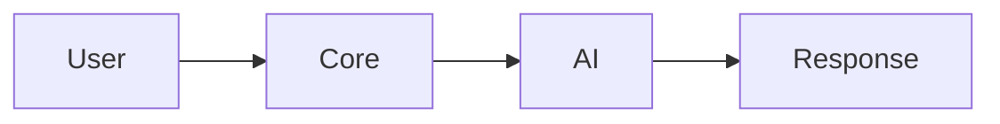

# Visual Flowcharts - Detailed & Complete

Esta pasta contém **fluxogramas visuais detalhados e completos** com todos os passos, decisões e caminhos possíveis do sistema JARVIS.

## 📊 Fluxogramas Disponíveis

### 1. [01-complete-system-flow.md](01-complete-system-flow.md)
**Fluxo Completo do Sistema (Início ao Fim)**
- Inicialização completa (HTML → Ready)
- Carregamento de todos os 9 plugins
- Inicialização das 5 skills
- Setup das 7 UI components
- Verificação de serviços externos
- Loop de processamento de queries
- Todos os caminhos de erro

**Inclui:**
- ✅ 100+ nós de decisão
- ✅ Todos os plugins individuais
- ✅ Todas as skills individuais
- ✅ Error handling completo
- ✅ Timeline detalhada

### 2. [02-detailed-query-flow.md](02-detailed-query-flow.md)
**Processamento Detalhado de Query**
- Input validation (empty, length, format)
- Context retrieval (STM + LTM + Entities)
- Personality application (mood + style + tone)
- AI request preparation (context + history + prompt)
- Network communication (Proxy + Ollama)
- AI generation (model loading + token generation)
- Response processing (styling + formatting)
- Memory storage (STM + LTM + entities)
- Learning recording (patterns + analysis)
- Display & voice output
- 10 fases completas
- Todos os error paths

**Inclui:**
- ✅ 44 passos detalhados
- ✅ 10 fases cronológicas
- ✅ Error handling diagram
- ✅ Performance metrics table
- ✅ Timing para cada fase

### 3. [03-complete-plugin-lifecycle.md](03-complete-plugin-lifecycle.md)
**Lifecycle Completo dos Plugins**
- Discovery de todos os 9 plugins
- Loading individual de cada plugin
- Validation checklist (5 verificações)
- Registration no PluginManager
- Initialization com error handling
- Event subscription para cada plugin
- Runtime event handling
- Disable flow para plugins falhados

**Inclui:**
- ✅ 9 plugins individualizados
- ✅ Validation checklist diagram
- ✅ Error paths para cada plugin
- ✅ Success/failure branches
- ✅ Runtime phase

## 🎨 Diferenças vs. Versões Anteriores

| Aspecto | Versões Anteriores | Versões Visuais |
|---------|-------------------|------------------|
| **Detalhamento** | Alto nível | Passo-a-passo completo |
| **Plugins** | Agregados | Individualizados (9) |
| **Skills** | Agregadas | Individualizadas (5) |
| **Error Handling** | Básico | Todos os caminhos |
| **Validações** | Implícitas | Explícitas com checks |
| **Timing** | Geral | Por fase detalhada |
| **Nós** | ~30-50 | 100+ por diagrama |

## 📐 Estrutura dos Fluxogramas

### Código de Cores

```
🟦 CYAN (#00d2d3)   - Início / Start states
🟩 GREEN (#00b894)  - Sucesso / Ready states  
🟥 RED (#d63031)    - Erros críticos / Failures
🟨 YELLOW (#fdcb6e) - Avisos / Warnings
```

### Símbolos Usados

```
([Oval])        - Start/End points
[Retângulo]     - Process/Action
{Diamante}      - Decision point
-->             - Flow direction
-->|Label|      - Conditional flow
```

### Emojis para Contexto

```
👤 - User/Person
🚀 - Start/Launch
⚙️ - Configuration/Settings
🔌 - Plugins
🧠 - Core/Intelligence
💬 - Chat/Messages
📝 - Tasks/Notes
📅 - Calendar
🌤️ - Weather
🔎 - Search
📁 - Files
⏰ - Reminders
📰 - News
🌍 - Translation
🎵 - Music
✅ - Success
❌ - Error
⚠️ - Warning
```

## 🔍 Como Usar

### Ver no GitHub
Basta abrir qualquer ficheiro `.md` - o GitHub renderiza Mermaid automaticamente.

### Seguir o Fluxo
1. Começa no nó **CYAN** (Start)
2. Segue as setas **→**
3. Nos diamantes **{}**, escolhe o caminho
4. Termina no nó **GREEN** (Success) ou **RED** (Error)

### Entender Timing
Cada diagrama inclui informação de timing:
- Fase 1: 0-500ms
- Fase 2: 500-1000ms
- etc.

## 📊 Estatísticas

| Fluxograma | Nós | Decisões | Caminhos | Error Paths |
|------------|-----|----------|----------|-------------|
| Complete System | 120+ | 25+ | 50+ | 15+ |
| Detailed Query | 80+ | 15+ | 30+ | 8+ |
| Plugin Lifecycle | 90+ | 18+ | 40+ | 9+ |

## 🔄 Comparação de Complexidade

### Versão Original (Mermaid simples)

**4 nós, caminho linear**

### Versão Visual Detalhada
```mermaid
flowchart TD
    User --> Validate --> Context --> Personality
    Personality --> Proxy --> Ollama
    Ollama --> Process --> Memory --> Display
    Validate -->|Error| ShowError
    Proxy -->|Error| FallbackMode
    # ... +70 nós adicionais
```
**80+ nós, múltiplos caminhos**

## 🎯 Use Cases

### Para Desenvolvimento
- Entender fluxo completo antes de codificar
- Identificar edge cases
- Planejar error handling
- Documentar lógica complexa

### Para Debug
- Seguir execução passo-a-passo
- Identificar onde falhou
- Ver caminhos alternativos
- Entender dependencies

### Para Documentação
- Onboarding de novos developers
- Explicar arquitetura
- Apresentações técnicas
- Review de design

### Para Testes
- Identificar casos de teste
- Cobrir todos os branches
- Validar error handling
- Test coverage planning

## 🛠️ Ferramentas Recomendadas

### Visualização
- **GitHub** (direto no browser)
- **VS Code** + Mermaid Preview extension
- [Mermaid Live Editor](https://mermaid.live/)

### Export
```bash
# Instalar mermaid-cli
npm install -g @mermaid-js/mermaid-cli

# Converter para PNG
mmdc -i 01-complete-system-flow.md -o system-flow.png -w 2000

# Converter para SVG
mmdc -i 02-detailed-query-flow.md -o query-flow.svg

# Converter para PDF
mmdc -i 03-complete-plugin-lifecycle.md -o plugins.pdf
```

## 📚 Próximos Fluxogramas

A adicionar:
- [ ] 04-memory-detailed-flow.md (STM + LTM + Entities completo)
- [ ] 05-automation-detailed-flow.md (Routines + Workflows + Triggers)
- [ ] 06-voice-processing-flow.md (Speech recognition + TTS)
- [ ] 07-learning-system-flow.md (Pattern analysis + Adaptation)
- [ ] 08-error-recovery-flow.md (Todos os error paths consolidados)

## 💡 Tips

1. **Zoom In**: Use Ctrl + Scroll no browser para ver detalhes
2. **Print/Export**: Use mermaid-cli para alta resolução
3. **Follow Path**: Use cores para seguir um caminho específico
4. **Read Notes**: Cada diagrama tem notas explicativas
5. **Check Timing**: Presta atenção aos timing annotations

## ✅ Checklist de Compreensão

Depois de ler os fluxogramas, deves conseguir responder:

- [ ] Quantos plugins são carregados?
- [ ] Quais são as 5 skills?
- [ ] Quantas fases tem o query processing?
- [ ] Quanto tempo demora a inicialização completa?
- [ ] O que acontece se um plugin falhar?
- [ ] Como é que o sistema lida com erro do Proxy?
- [ ] Quando é que uma memória vai para LTM?
- [ ] Que validações são feitas no input do user?
- [ ] Como funciona a personality application?
- [ ] Qual é o caminho do voice output?

**Respostas:**
1. 9 plugins
2. Voice, Learning, Memory, Personality, Automation
3. 10 fases
4. ~5 segundos
5. Log error e continua sem ele
6. Mostra erro e entra em fallback mode
7. Quando importance score >= 5
8. Empty check, length check, format check
9. Mood + Style + Tone application
10. Response → Check voice enabled → Select voice → Set rate/pitch → Speak

## 🔗 Links Relacionados

- [Fluxogramas Mermaid Originais](../)
- [Fluxogramas FrogProG](../fprg/)
- [Documentação Completa](../../README.md)
- [Suite de Testes](../../tests/jarvis-tests.fprg)
